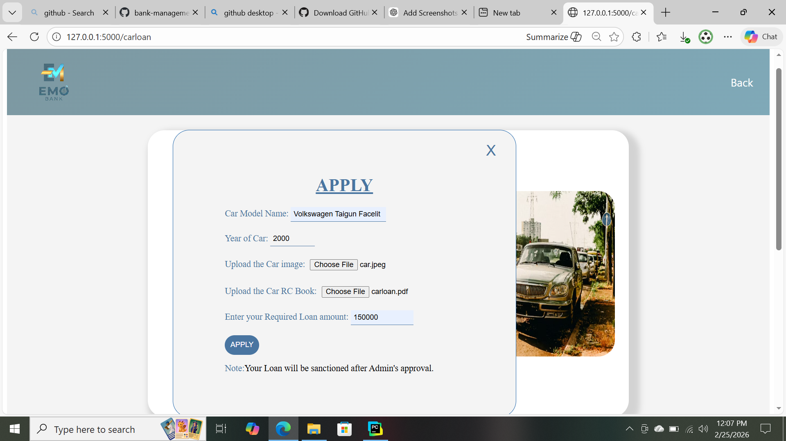
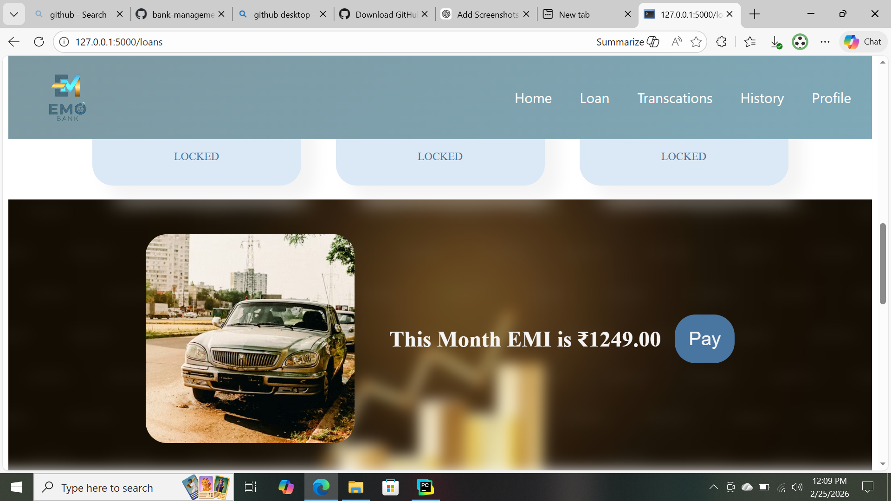
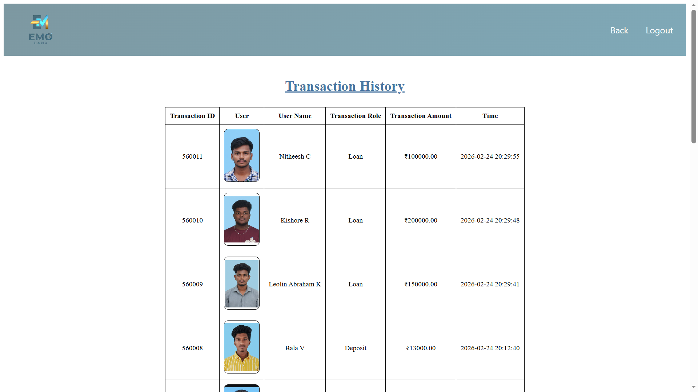
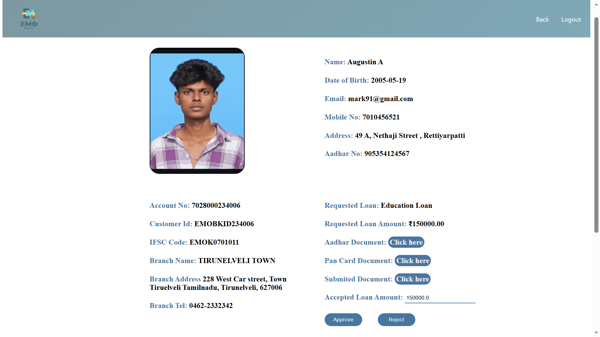

# 🏦 Bank Management System

The **Bank Management System** is a full-stack web application developed using  
HTML, CSS, JavaScript, Python (Flask), and MySQL.

This system allows users to apply for loans, pay EMIs, deposit and withdraw money, 
and track transaction history. Admins can approve loans, manage deposit requests, 
and monitor user activities.

---

## 🚀 Features

### 👤 User Features
- User Registration & Login
- Apply for Loans (Home Loan, etc.)
- Loan Approval Status Tracking
- EMI Calculation & EMI Payment
- Deposit Money Request
- Withdraw Money
- View Transaction History
- Profile Management

### 🛠️ Admin Features
- Admin Login
- Approve / Reject Loan Applications
- Approve Deposit Requests
- View All Users
- View Borrowers List
- Monitor Transaction History
- Manage Loan Records

---

## 🛠️ Technologies Used

- **Frontend:** HTML, CSS, JavaScript
- **Backend:** Python (Flask)
- **Database:** MySQL
- **Server:** Flask Development Server (Localhost)

---

## 🖥️ System Architecture

Frontend (HTML/CSS/JS)  
⬇  
Flask Backend (Python)  
⬇  
MySQL Database  

The system follows a client-server architecture where:
- User requests are handled by Flask routes
- Data is stored and retrieved from MySQL
- Business logic (Loan, EMI, Transactions) is processed in backend

---

## 📸 Screenshots

### 🏠 Home Page

---

### 🛠️ Admin Dashboard

---

### 🏠 Loan Application Page

---

### 💰 EMI Payment Page

---

### 📊 Transactions Dashboard

---

### 🛠️ Admin – Loan Approval Panel

---

## 💳 Core Functional Modules

### 🔹 Loan Management
- Users can apply for loans
- Admin approves or rejects loan
- EMI amount calculated automatically
- Monthly EMI payment tracking

### 🔹 Transaction Management
- Deposit requests
- Withdraw transactions
- EMI payments recorded
- Full transaction history maintained

### 🔹 Role-Based Access
- Separate User and Admin access
- Session-based authentication

---

## ⚙️ How to Run Locally

1️⃣ Install Python (3.x)

2️⃣ Install required packages:

3️⃣ Configure MySQL database  
- Create database  
- Import tables  
- Update DB credentials in `app.py`

4️⃣ Run the application: http://127.0.0.1:5000/

---

## 🎯 Key Concepts Demonstrated

- Full Stack Development
- CRUD Operations
- Session Management
- Role-Based Authentication
- EMI Calculation Logic
- File Upload Handling
- Transaction Processing
- MySQL Integration with Flask

---

## 📌 Project Type

Academic College Major Project  
Developed for learning and demonstration purposes.

---

## 📌 Note

This project was developed for academic purposes and runs locally using Flask and MySQL.  
It demonstrates full-stack development concepts including authentication, CRUD operations, and database integration.

---
